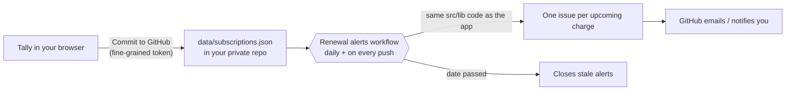

<div align="center">

# Tally

**A local-first money dashboard for the recurring stuff.**
Subscriptions you forgot about, costs you share with friends, and a grocery total that includes tax before you reach the register.
Plus GitHub Actions that open an issue (and email you) before anything renews.

[](../../actions/workflows/ci.yml)


</div>

## What's inside

### Install it like an app
Tally is an installable web app (PWA). The **Install app** button in the header uses the browser's own install prompt in Chrome, Edge and on Android. On iPhone, iPad and Safari for Mac it shows the exact steps instead. Once installed it:

- opens from its own icon in a standalone window, **works fully offline**, and precaches every file at install time
- shows a **badge on the app icon** with the number of renewals due in the next 3 days
- has **app shortcuts** (long-press or right-click the icon): *Add subscription*, *Log shared expense*, *Open cart*
- **opens `.csv` bank exports and `.json` backups** straight from your file manager (desktop Chrome and Edge)
- **reminds you on the device itself.** Turn on *Reminders* (Sync → Preferences) and you'll get a notification when each subscription enters its reminder window. The notification appears when Tally opens, and in the background too for the installed app in Chrome and Edge. No GitHub needed, and a reminder is never shown twice
- **updates safely**: a new version downloads in the background and waits for you to click *Reload*, so nothing changes while you're typing


Chrome reports zero installability errors, and a test checks that it loads offline and swaps to a new version when you click *Reload*.

<br clear="right">

### Help desk (with AI that actually answers)
A **Help** tab, plus an **Ask** button on every screen, answers questions about any feature or money term, in layers so it always works:

1. **Built-in help library.** 38 articles and a 34-term glossary written for Tally, with a ranked offline search. Instant, free, works offline. It picks the right article first for 33 of 34 real test questions, and for all 34 it's in the top three.
2. **On-device AI**: Chrome's built-in model (Prompt API) when the browser has it. Private and free.
3. **Your site's own assistant**: deploy the optional [Cloudflare Worker](helpdesk-worker/README.md) once, and every visitor gets AI answers without a key. Your key stays server-side, with an origin check, rate limits, and a guard that keeps it to Tally topics.
4. **Your own key**: Google Gemini (free tier), Claude, or any OpenAI-compatible service (OpenAI, OpenRouter, Groq, a local Ollama). Stored only in your browser.

AI answers are **grounded**: every question retrieves the most relevant help articles and sends them as the reference, with rules not to invent buttons or give personal financial advice. With your permission, a summary of your own numbers is included (never incomes or tokens), so it can answer "why is *my* gym flagged?". Answers stream in, render as safe Markdown (links to app sections work), and keep the conversation for follow-ups. **"?" tips** next to jargon across the app explain terms in place.


### Subscriptions
- **The rosette.** The header pattern is a banknote-style guilloché drawn from your real data: one woven ring per subscription, cheapest inside, priciest outside. Ring swell shows cost, lobe count shows billing frequency, and red rings need attention.
- **Explainable review flags** instead of one opaque "risk" score: *Unused*, *Low value* (cost per use), *High cost*, *Trial ending*, *Annual renewal soon*. Each flag says why it fired.
- **"What if I cancel?"** Tick any rows to see the savings per year and over 5 years.
- **Renewal calendar** by month, plus a **12-month forecast** that shows what actually leaves your account each month. Annual renewals show up as tall bars against your dashed average.
- **Add to your calendar.** Export every renewal as an `.ics` file for Google, Apple or Outlook Calendar, with a reminder matching each subscription's lead time. Month-end billing (the 31st) is written so short months fall back to their last day instead of being skipped.
- **Price history.** Change a price and Tally records the old one, flags the increase (*Up 16%*) for six months, and shows the history in the edit dialog.
- **Search and sort** by next charge, monthly cost, name, or *needs review*.
- **Find subscriptions in a bank export.** Drop in a CSV from your bank. Tally groups merchants, finds charges that repeat on a steady schedule, and **flags price increases** (for example, "up from $15.49"). The file is parsed in your browser and never uploaded.
- Weekly, monthly, quarterly and annual cycles; free trials; pausing. Renewal dates are computed from an anchor, so a subscription billed on the 31st goes back to the 31st after February.

### Split
- Split equally, **by income**, by shares, or by exact amounts, with a live preview of each person's share.
- Expenses in other currencies record the exchange rate used (with an optional fetch of today's rate from the ECB via Frankfurter).
- **Settle up in the fewest payments possible.** See [how](#the-fewest-payments).
- "Mark paid" records the settlement in the ledger instead of deleting history.
- **Copy for group chat** puts a plain-text summary of who pays whom on your clipboard.
- **Share a read-only link.** Friends open it and see who owes whom, balances and the ledger, and can save a copy. The whole group is compressed into the part of the URL after `#`, which browsers never send to a server, so nothing is uploaded anywhere. **Incomes are never included**: income-based splits are converted to the exact amounts they produced, so balances stay identical.


### Cart
- Taxable vs exempt items, a live budget meter, and a separate "already in the basket" total.
- If you're over budget, Tally suggests the smallest item to leave out.

### Everywhere
- Undo for every change (button, <kbd>U</kbd>, or the toast), plus keyboard shortcuts (<kbd>1</kbd>–<kbd>4</kbd>, <kbd>N</kbd>, <kbd>T</kbd>, <kbd>?</kbd>).
- Light and dark themes, full mobile layout with a bottom tab bar, and reduced-motion support.
- Installable PWA that works offline. Fonts are bundled, so the app makes **no third-party requests**.
- Backups are JSON, and **backups from the original FinHub prototype import and migrate automatically**.
- **Drop a file anywhere** in the window: a bank CSV goes to subscription detection, a backup goes to restore.
- **Two devices?** *Pull from GitHub* loads the subscriptions you committed from another device.

| 12-month forecast | Split | Cart | Dark | Mobile |
| :-: | :-: | :-: | :-: | :-: |
|  |  |  |  |  |

## Renewal alerts with GitHub Actions

Other tools stop at "paste this YAML". This one runs.



- `scripts/renewal-check.ts` imports **the same billing and date code as the web app**, so the dashboard and the alerts always agree.
- **Optional end-to-end encryption.** Tick *Encrypt the file with a passphrase* and the repo only ever holds AES-256-GCM ciphertext (PBKDF2-SHA-256, 600,000 iterations, fresh salt and IV per commit). Add the same passphrase as the `TALLY_PASSPHRASE` secret and the Action decrypts in memory. Issue titles then say *when* something renews, not *what* (set the `TALLY_REDACT` variable to `0` to change that). A wrong passphrase or a tampered file is detected, never silently misread.
- Uses the built-in `GITHUB_TOKEN`. There's no SMTP server, no secrets, and no third-party service.
- **Idempotent.** Each issue carries a hidden key (`subscription id + date`), so re-runs never duplicate and an issue you close stays closed.
- Writes a Markdown report of every subscription to the job summary.
- Covered by an integration test that runs the real script against a fake GitHub API.

## Set it up for yourself

> **Publishing to GitHub Pages?** Follow [DEPLOY.md](DEPLOY.md). The project must sit at the **top level** of the repository, and Pages' *Source* must be **GitHub Actions**. Otherwise GitHub shows only your README's title.

1. Click **Use this template** and make the new repo **private** (it will hold your subscription list).
2. In the new repo, open **Settings → Pages** and set *Source* to **GitHub Actions**. The app deploys to `https://<you>.github.io/<repo>/`. You can also run it locally (see below).
3. Create a [fine-grained token](https://github.com/settings/personal-access-tokens/new) limited to that one repo with **Contents: Read and write**.
4. In Tally, open **Sync**, enter the owner, repo and token. Optionally tick **Encrypt the file with a passphrase** (recommended) and add the same passphrase as a repository secret named `TALLY_PASSPHRASE`. Then click **Commit to GitHub**. The token and passphrase stay in memory only.
5. That's it. The **Renewal alerts** workflow runs every morning and whenever the file changes. Set a repo variable `TZ` (for example, `Europe/London`) if you're not in US Central.

> Prefer not to use a token? Click **Download file instead**, then commit `data/subscriptions.json` yourself.

## Run locally

```bash
npm install
npm run dev          # http://localhost:5173
npm test             # 154 unit + integration tests (incl. the Action vs a fake GitHub API, the helpdesk Worker, AI stream formats)
npm run e2e          # 67 browser tests on desktop and mobile, incl. WCAG 2.1 AA scans in both themes
npm run lighthouse   # Lighthouse budgets on the production build
npm run build        # typecheck + production build
npm run renewals     # dry run of the alert script against data/subscriptions.json
```

### Quality gates (run in CI on every push)

| Check | What it covers |
| :-- | :-- |
| **Vitest** (154) | Money math, dates, settlement optimality, CSV detection, encryption (round-trip, wrong passphrase, tampering), reminders, share links, schema migration, help search accuracy on real questions, AI request/stream formats for Gemini, Claude and OpenAI, the helpdesk Worker (origin, limits, streaming, no key leaks), and the Action run end to end against a fake GitHub API |
| **Playwright** (67, desktop + Pixel 7) | Add/edit/undo, price-rise flag, bank import, calendar export, income splits, settle-up, share link on a fresh profile, encrypted commit and pull, offline start, install prompt, keyboard use, help desk (offline answers, streamed AI answers, follow-ups, data-sharing consent, rejected keys, "?" tips, deep links), and **no screen wider than the phone** |
| **axe-core** | WCAG 2.1 A/AA on every section, in light and dark themes |
| **Lighthouse CI** | Performance ≥ 90, accessibility ≥ 95, best practices ≥ 95 (currently 100 / 100 / 100 / 100) |

The Worker was also run in Cloudflare's real runtime (`wrangler dev`). That caught a deploy-blocking bug the unit tests couldn't: extra named exports in a Worker's entry module stop it from starting.

These gates caught real bugs while they were being written: text contrast below 4.5:1, form labels that read every dropdown option aloud, the bank-import screen not closing after *Add*, typing lost in Sync fields during a re-render, and a chart that made the whole page wider than a phone.

Try the bank-import flow with [`examples/bank-export-sample.csv`](examples/bank-export-sample.csv).

## How it works

### Money is integers
Every amount is stored in minor units (cents; whole yen for JPY). Tax rates are basis points (`825` = 8.25%). Splits use the **largest-remainder method**, so $100 split three ways is `33.34 + 33.33 + 33.33` and always adds back to exactly $100.00. The original prototype used floats, so balances could drift by a cent and never quite settle.

### The fewest payments
If *n* people have non-zero balances, *n − 1* payments always settle the group. But if those people can be partitioned into *k* groups that each sum to zero, only *n − k* are needed. Finding the largest such partition is NP-hard, so for up to 16 people Tally solves it exactly with a DP over subsets (`O(2ⁿ·n)`), and above that falls back to a greedy heuristic.

The classic "match the biggest debtor with the biggest creditor" greedy is not optimal. For balances `{−6, −4, −5, +5, +10}` it produces 4 payments; Tally finds 3 by pairing `−5/+5`. There's a test for that.

### Recurring charge detection
Merchant strings are normalized (`SQ *BLUE BOTTLE COFFEE #221` → `Blue Bottle Coffee`), grouped, and checked for a median gap that matches a weekly, monthly, quarterly or annual cycle within a tolerance, with a stable price. A steady price followed by one different charge is reported as a price change instead of being discarded.

### Architecture

```
src/
  lib/            Pure, framework-free domain code, shared with the Action
    money.ts        minor units, parsing, allocation, currency conversion
    dates.ts        timezone-safe ISO date math, anchored renewals, month grids
    subscriptions.ts  totals, renewals, audit flags, savings
    settle.ts       splits, balances, optimal settlement
    cart.ts         tax, budget, suggested cuts
    csv.ts          CSV parser, bank-export normalization, recurring detection
    schema.ts       versioned state, validation, v1 → v2 migration
    report.ts       Markdown report + issue text
    github.ts       Contents API client (commit + pull)
    crypto.ts       AES-256-GCM + PBKDF2 passphrase encryption (Web Crypto; same code in the Action)
    repofile.ts     Plain or sealed repo file
    reminders.ts    Reminder schedule and "due today" logic
    share.ts        Read-only split links: income redaction + deflate + base64url
  help/
    articles.ts     The help library: articles + glossary (source of truth for search and AI)
    search.ts       Offline BM25 search with synonyms; retrieval for the AI
    ai.ts           Providers (on-device, Gemini, Claude, OpenAI-compatible, proxy), SSE parsing
    prompt.ts       Grounded system prompt + privacy-safe data summary
    markdown.ts     Safe Markdown → DOM for answers
helpdesk-worker/  Optional Cloudflare Worker so visitors get AI answers without a key
    ics.ts          iCalendar export with RFC 5545 folding and month-end rules
  views/          One file per tab, plus shared.ts (read-only split link) and help.ts (help desk)
  ui/             Small DOM helper (strings become text nodes, so no XSS), rosette, icons,
                  install.ts (install prompt + per-platform steps), pwa.ts (updates, badge, file intake),
                  reminders.ts (notifications, IndexedDB schedule, periodic sync)
public/sw.js      Service worker; vite.config.ts injects the precache list and version hash
  store.ts        Single store: undo stack, persistence, cross-tab sync
scripts/renewal-check.ts   The GitHub Action
tests/                     Vitest
e2e/                       Playwright + axe
```

No framework and **no runtime dependencies**. The bundle is about 63 kB of gzipped JS, about half of it the help library. All user text is rendered as text nodes, never `innerHTML`.

## Privacy

Everything lives in your browser's `localStorage`. Nothing is sent anywhere unless you click **Commit to GitHub** or **Pull from GitHub** (to `api.github.com`, your repo only) or **Use today's rate** (to the Frankfurter ECB rates API). Only subscriptions are written to the repo, and with encryption on, the repo holds only ciphertext. Shared expenses and your cart never leave the device unless you share a split link, which carries the data inside the link itself and leaves out incomes. Questions to the help desk go to the AI provider you chose (or nowhere, with the built-in help or on-device AI), and your data is included only if you tick *Let the AI see my Tally data*. AI keys are stored only in your browser and never included in backups.

## Roadmap ideas

- [ ] Price-change alerts in the Action (compare against git history)
- [ ] OFX/QFX import

## License

[MIT](LICENSE)
