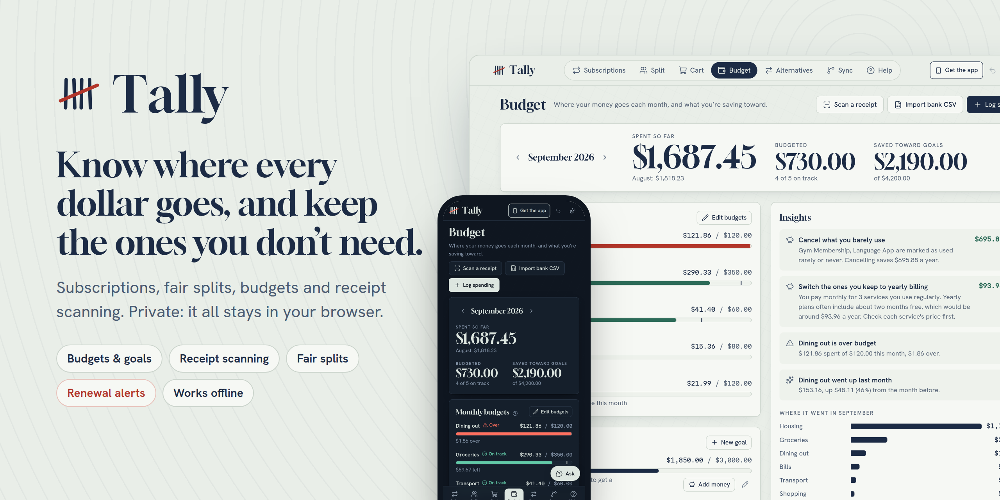

# Tally

**Know where every dollar goes, and keep the ones you don't need.**

A local-first money dashboard. No account, no server, no tracking: your data stays in your browser.

| | |
| :-- | :-- |
| **Subscriptions** | Every recurring charge, what it really costs, when it renews, and which ones to cancel. Finds forgotten ones in a bank export. |
| **Split** | Shared costs split equally, by income, by shares or exact amounts, settled in the fewest possible payments. |
| **Cart** | A shopping list with the real total, tax included, and a budget meter. |
| **Safe to spend** | One number: what you can spend each day until payday, after the bills and subscriptions due before then. |
| **Budget** | Monthly budgets, savings goals, bills with due dates and reminders, charts of where your money goes, and saving tips. |
| **Receipt scanning** | Photograph a receipt. It's read on your device (never uploaded) and turned into spending, cart items, or a split item by item. |
| **Move to another device** | Send everything from your computer to your phone with a moving QR code, a file or a link, encrypted with a one-time code. |
| **Languages** | Asks “What language do you speak?” on the first visit, with 100+ languages and a search box. Built in: English, Spanish, Hindi, French, Portuguese, German, Chinese, Arabic (right-to-left), Bengali, Telugu and Tamil. Others are translated on the device where the browser can, or with the browser’s own Translate. Change or reset it any time with the language button at the top. |
| **Alternatives** | Ideas for cheaper, better or better-value alternatives to anything you pay for, with a shortlist. |
| **Help desk** | A built-in help library, plus optional AI answers. |
| **Sync & alerts** | Optional: save to your own GitHub repo (encrypted if you like) and get an email before every renewal. |

It installs like an app (click **Get the app**: there's a QR code to open it on your phone, and steps for iPhone, Android and computers), works offline, and has light and dark themes.

This is the **one-file version**: the whole app is in `index.html`, and everything else sits next to it in the same folder.

## Files

| File | What it is |
| :-- | :-- |
| `index.html` | The entire app: all code, styles and built-in languages (compressed so it loads fast). Open it in a browser to use it. |
| `tally-icon.svg`, `tally-icon-192.png`, `tally-icon-512.png`, `tally-icon-maskable-512.png`, `tally-apple-touch-icon.png` | The logo in the sizes browsers and phones need |
| `tally-gloock.woff2`, `tally-hanken-grotesk.woff2`, `tally-martian-mono.woff2` | The three fonts |
| `tally-manifest.webmanifest` | Lets people install Tally as an app |
| `tally-sw.js` | Makes Tally work offline and handles reminders |
| `tally-renewal-check.mjs` | Optional: powers email alerts before renewals (see below) |
| `tally-preview.png` | The picture at the top of this page. Also use it as the repository's social preview (see below) |

## Put it on GitHub Pages

1. In your repository on github.com, click **Add file → Upload files**.
2. Click **choose your files**, select **all** of these files, then click **Commit changes**. There are no folders, so nothing gets skipped.
3. Open **Settings → Pages**. Under *Build and deployment*, set **Source** to **Deploy from a branch**, choose **main** and **/ (root)**, then click **Save**.
4. Wait about a minute and open `https://<your-username>.github.io/<repository>/`.

To update later, upload the changed files again. Uploading replaces files with the same name.

## Use your own domain (optional)

1. Buy a domain from a registrar (Cloudflare, Namecheap, Porkbun…).
2. Add a DNS record there: for `tally.yourname.com`, a **CNAME** pointing to `finpathdev.github.io`. For a bare `yourname.com`, four **A** records: `185.199.108.153`, `185.199.109.153`, `185.199.110.153`, `185.199.111.153`.
3. In this repository, open **Settings → Pages → Custom domain**, type the domain and click **Save**.
4. Once the check passes, tick **Enforce HTTPS**.

## Feedback

The **Send feedback** and **Report a problem** links at the bottom of the app open a pre-filled issue in this repository. Keep **Issues** turned on in **Settings → General → Features** to receive them.

## Make links to your repository look good

On GitHub, open **Settings → General**, scroll to **Social preview**, click **Edit → Upload an image**, and choose `tally-preview.png`. Links to the repository then show that picture.

## Edit it

`index.html` is generated and minified (squeezed onto a few long lines) so the site loads quickly, which makes it hard to edit by hand. To change Tally, edit the readable source in the full project (`tally.zip`, folder `src/`), then run `npm run build:site` to make a new set of these files and upload them again.

You can open `index.html` straight from your computer to try it. Offline mode and the install button only work once it's on your website (https).

## Optional: email alerts before renewals

Tally works without this. It's only for getting an email from GitHub a few days before each subscription renews.

1. In the app, open **Sync → Email alerts before renewals → Show steps**.
2. Click **Create the alerts workflow**. It opens GitHub with the file already filled in; click **Commit changes**.
3. Turn on **Issues** in **Settings → General → Features**.
4. Back in Tally, check **Owner** is your GitHub **username** (not your email) and **Repository** is this repository's name. On your site they're filled in for you. Create a token as the app explains, keep **Encrypt** on (this repository is public, so your list is stored scrambled), and click **Commit to GitHub**. Add the same passphrase as a repository secret named `TALLY_PASSPHRASE`.

Every morning GitHub checks your renewals and opens an issue for anything coming up, and GitHub emails you about it.

## Receipt scanning and privacy

Receipt photos are read by a text-recognition engine running in your browser; the photo is never uploaded. The first scan downloads the engine (about 5 MB) from jsDelivr, a public code library, and after that it's cached, so scanning works offline too.

## Optional: AI answers in the help desk and Alternatives

The help desk always works using its built-in help library, and Alternatives always shows ways to pay less. For AI-written answers and specific alternatives, open **Help → AI assistant** and add a free Google Gemini key (the app shows you how), or set up the shared proxy described in the full project so no visitor needs a key.

---

This file set is generated from the full project (TypeScript source, tests and build tools) with `npm run build:site`. You only need the full project if you want to change the app's code in a structured way or run the tests.
